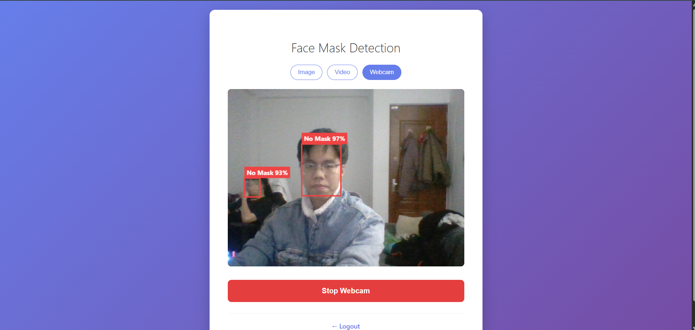
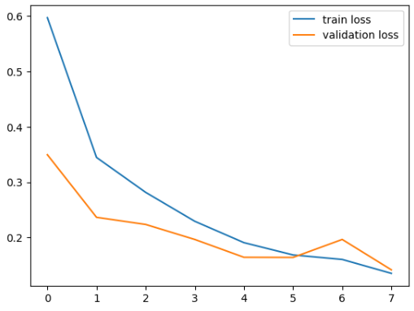
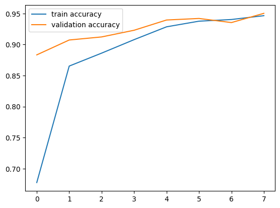

# Face Mask Detection System

Hệ thống nhận diện khẩu trang thời gian thực sử dụng Deep Learning và Computer Vision. Có thể phát hiện khuôn mặt và phân loại người đeo/không đeo khẩu trang qua hình ảnh hoặc webcam.

## 🎯 Tính năng chính

- ✅ **Nhận diện khuôn mặt**: Sử dụng DNN model để detect faces
- ✅ **Phân loại khẩu trang**: AI model phân biệt có/không đeo khẩu trang  
- ✅ **Real-time detection**: Hỗ trợ webcam và upload ảnh
- ✅ **REST API**: FastAPI với Swagger documentation
- ✅ **Web Interface**: Giao diện web responsive
- ✅ **Authentication**: Hệ thống đăng ký/đăng nhập với JWT
- ✅ **File Storage**: MinIO object storage
- ✅ **Containerized**: Docker & Docker Compose

## 🏗️ Kiến trúc hệ thống

```
┌─────────────────┐    ┌─────────────────┐    ┌─────────────────┐
│   Frontend      │    │    Backend      │    │     MinIO       │
│   (HTML/JS)     │◄──►│   (FastAPI)     │◄──►│  (Storage)      │
│   Port: 3000    │    │   Port: 8000    │    │   Port: 9000    │
└─────────────────┘    └─────────────────┘    └─────────────────┘
                              │
                              ▼
                    ┌─────────────────┐
                    │   AI Models     │
                    │  - Face Detect  │
                    │  - Mask Classify│
                    └─────────────────┘
```

### Cấu trúc thư mục

```
face-mask-detection/
├── backend/                    # FastAPI Backend
│   ├── app/
│   │   ├── api/routes/        # API endpoints
│   │   ├── core/              # Config, security, logging
│   │   ├── service/           # Business logic
│   │   ├── schemas/           # Pydantic models
│   │   └── main.py            # FastAPI application
│   ├── model/                 # AI Models
│   │   └── model.h5           # Mask classification model
│   └── requirements.txt
│   └── yolo8n-face.pt         # ace detection model
├── frontend/                   # Web Interface
│   ├── css/style.css
│   ├── js/auth.js
│   ├── index.html             # Login/Register page
│   └── dashboard.html         # Main application
├── minio/data/                # MinIO storage data
├── docker-compose.yml         # Setup
├── .env                       # Environment variables
└── README.md
```

## 🚀 Cách chạy hệ thống

### Phương pháp 1: Docker 

```bash
# Clone repository
git clone <repository-url>
cd face-mask-detection

# Chạy tất cả services
docker-compose up --build

# Hoặc chạy background
docker-compose up -d --build
```

**Truy cập ứng dụng:**
- Frontend: http://localhost:3000
- Backend API: http://localhost:8000  
- API Documentation: http://localhost:8000/docs
- MinIO Console: http://localhost:9001

### Phương pháp 2: Development Local

```bash
# 1. Cài đặt Python dependencies
python -m venv venv
venv\Scripts\activate  # Windows
# source venv/bin/activate  # Linux/Mac

# Load enviroment
.\load_env.ps1

cd backend
pip install -r requirements.txt

# 2. Chạy MinIO
docker-compose up minio -d

# 3. Chạy Backend
uvicorn app.main:app --host 0.0.0.0 --port 8000 --reload

# 4. Chạy Frontend (terminal khác)
cd frontend
python -m http.server 3000
```

## 🔧 Cấu hình

### Environment Variables

Copy `.env.example` thành `.env` và cập nhật:

```env
# MinIO Storage
MINIO_ENDPOINT=minio:9000
MINIO_ACCESS_KEY=admin
MINIO_SECRET_KEY=admin123
MINIO_BUCKET=uploads

# JWT Authentication  
JWT_SECRET_KEY=your-super-secret-key-here
JWT_ALGORITHM=HS256
ACCESS_TOKEN_EXPIRE_MINUTES=60

# Application
APP_HOST=0.0.0.0
APP_PORT=8000
```

**⚠️ Quan trọng**: Thay đổi `JWT_SECRET_KEY` trong production!

```bash
# Tạo JWT secret key mạnh
python -c "import secrets; print(secrets.token_urlsafe(32))"
```

## 📊 Dataset và Mô hình

### Dataset

- **Nguồn**: [Face Mask Dataset](https://www.kaggle.com/datasets/omkargurav/face-mask-dataset)
- **Kích thước**: ~7,500 hình ảnh với annotations
- **Phân loại**: 
  - With Mask: ~3,750 ảnh
  - Without Mask: ~3,750 ảnh
- **Format**: JPG/PNG với bounding box annotations

---

## Kiến trúc mô hình

### 1. Face Detection Model (YOLOv8-Face)

* **Framework**: Ultralytics YOLOv8 + PyTorch
* **Architecture**: YOLOv8-Face (One-stage object detector)
* **Input**: RGB image (tự động resize theo cấu hình YOLO, thường 640×640)
* **Output**:

  * Face bounding boxes `(x1, y1, x2, y2)`
  * Confidence score
* **Đặc điểm**:

  * Phát hiện khuôn mặt **nhanh và chính xác** trong thời gian thực
  * Hoạt động tốt với nhiều kích thước khuôn mặt, góc nhìn khác nhau
* **Model file**:

  * `yolov8-face.pt` (pre-trained weights)
* **Vai trò trong hệ thống**:

  * Phát hiện và cắt (crop) vùng khuôn mặt
  * Chuyển ảnh khuôn mặt sang mô hình phân loại khẩu trang

---

### 2. Mask Classification Model (`model.h5`)

* **Framework**: TensorFlow / Keras
* **Architecture**: Convolutional Neural Network (CNN) tùy chỉnh
* **Input Shape**: `(128, 128, 3)`
* **Output**:

  * Binary classification:

    * `0` → No Mask
    * `1` → Mask
* **Activation Function**:

  * Output layer: `sigmoid`
* **Loss Function**:

  * `binary_crossentropy`
* **Optimizer**:

  * `Adam`
* **Training Dataset**:

  * Ảnh khuôn mặt đã được cắt từ ảnh gốc
  * Gồm hai lớp: *Mask* và *No Mask*
* **Vai trò trong hệ thống**:

  * Nhận ảnh khuôn mặt từ YOLOv8-Face
  * Dự đoán trạng thái đeo khẩu trang

#### Kiến trúc tổng quát của mô hình

```python
Input (128x128x3)
↓
Conv2D + ReLU
↓
MaxPooling2D
↓
Conv2D + ReLU
↓
MaxPooling2D
↓
Flatten
↓
Dense + ReLU
↓
Dense(1) + Sigmoid
```

> Mô hình CNN nhẹ, phù hợp cho suy luận thời gian thực khi kết hợp với YOLOv8-Face.

---

### Training Configuration

* **Loss Function**:
  `Binary Crossentropy`
  → Phù hợp cho bài toán phân loại nhị phân (Mask / No Mask)

* **Optimizer**:
  `Adam`
  → Tốc độ hội tụ nhanh, ổn định với dữ liệu ảnh

* **Early Stopping**:
  Theo dõi `val_loss`, dừng huấn luyện khi không cải thiện sau **5 epoch**
  → Giảm overfitting, tiết kiệm thời gian huấn luyện

* **Model Checkpoint**:
  Lưu mô hình tốt nhất dựa trên **val_loss thấp nhất**
  → Đảm bảo sử dụng mô hình có hiệu năng cao nhất trong suy luận

---

## Đánh giá mô hình

### Metrics

* **Accuracy**: ~95–98%
* **Precision**: ~95%
* **Recall**: ~96%
* **F1-Score**: ~95–96%

> (Kết quả phụ thuộc vào tập dữ liệu và số epoch huấn luyện)

---

### Training Results

* **Training Accuracy**: ~98%
* **Validation Accuracy**: ~95%
* **Training Loss**: Giảm đều theo epoch
* **Validation Loss**: Ổn định, không overfitting rõ rệt
* **Epochs**: 20–30

---

## Tổng quan hệ thống

1. YOLOv8-Face phát hiện khuôn mặt trong ảnh/video
2. Mỗi khuôn mặt được cắt và resize về `(128×128)`
3. CNN (`model.h5`) dự đoán *Mask / No Mask*
4. Kết quả được hiển thị trực tiếp lên khung hình


#### Performance Charts


## 🔬 Công nghệ sử dụng

### Backend
- **FastAPI**: Modern Python web framework
- **TensorFlow/Keras**: Deep learning framework
- **OpenCV**: Computer vision library
- **Pydantic**: Data validation
- **JWT**: Authentication
- **MinIO**: Object storage
- **Uvicorn**: ASGI server

### Frontend  
- **HTML5/CSS3**: Web interface
- **JavaScript (ES6+)**: Client-side logic
- **Fetch API**: HTTP requests

### Infrastructure
- **Docker**: Containerization
- **Docker Compose**: Multi-container orchestration
- **Nginx**: Web server (in frontend container)

### AI/ML Stack
- **Face Detection**: OpenCV DNN với SSD MobileNet
- **Mask Classification**: Custom CNN model
- **Image Processing**: OpenCV, PIL/Pillow
- **Data Pipeline**: NumPy, imutils

## 📝 API Documentation

### Authentication Endpoints

```http
POST /auth/register
Content-Type: application/json

{
  "username": "string",
  "password": "string"
}
```

```http
POST /auth/login
Content-Type: application/json

{
  "username": "string", 
  "password": "string"
}
```

### Prediction Endpoints

```http
POST /predict/from-file
Authorization: Bearer <token>
Content-Type: multipart/form-data

file: <image_file>
```

```http
POST /predict/from-minio
Authorization: Bearer <token>
Content-Type: application/json

{
  "object_name": "string"
}
```

### Response Format

```json
{
  "faces_detected": 2,
  "results": [
    {
      "box": {
        "startX": 100,
        "startY": 50, 
        "endX": 200,
        "endY": 150
      },
      "label": "Mask",
      "confidence": 0.9876
    }
  ]
}
```

## 🧪 Testing

### Tạo tài khoản test

```bash
# Qua cURL
curl -X POST "http://localhost:8000/auth/register" \
  -H "Content-Type: application/json" \
  -d '{"username": "test", "password": "test123"}'

# Qua Frontend
# Truy cập http://localhost:3000 và click "Đăng ký ngay"
```

### Test API

```bash
# Health check
curl http://localhost:8000/

# Get API docs
curl http://localhost:8000/docs
```

## 🐛 Troubleshooting

### Lỗi thường gặp

1. **bcrypt version error**
   ```bash
   pip install bcrypt==4.0.1 passlib[bcrypt]
   ```

2. **OpenCV GUI error trong Docker**
   - Đã sửa trong Dockerfile với các thư viện cần thiết

3. **Port đã được sử dụng**
   ```bash
   # Kiểm tra port
   netstat -ano | findstr :8000
   # Kill process
   taskkill /PID <PID> /F
   ```

4. **MinIO connection failed**
   ```bash
   docker-compose ps  # Kiểm tra services
   docker-compose up minio -d  # Chỉ start MinIO
   ```
## 🙏 Acknowledgments

- [Face Mask Dataset](https://www.kaggle.com/datasets/omkargurav/face-mask-dataset) - Kaggle dataset
- OpenCV team - Face detection model
- FastAPI team - Web framework
- TensorFlow team - ML framework
